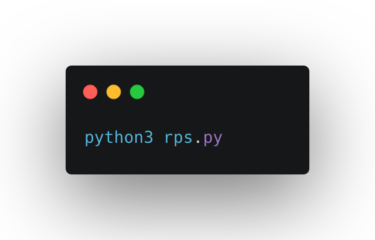
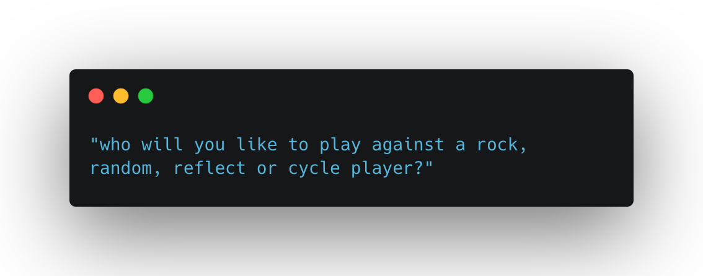

# Rock Paper Scissors

In the terminal run file by typing :

You will be prompted by the following message :

In this script you will be able to play against a couple of different computer players in the infamous game of Paper Scissors Rock.

| Opponent |              Strategies               |
| -------- | :-----------------------------------: |
| Rock     |            only plays rock            |
| Random   |         randomly makes choice         |
| reflect  | chooses whatever you chose previously |
| cycle    |       iterates through choices        |

During the build of this project I learned some fundamentals of OOP in python. Such as inheritance, I used this to create some of the opponents from a single player class and defined the init to override some methods of choice. Instantiating variables and when to use them. How to pass an known number of parameters to a method by using the `*args` parameter.

In the future I hope to implement a game mode where different strategies play against each other. keep track of which strategy has the most wins.
